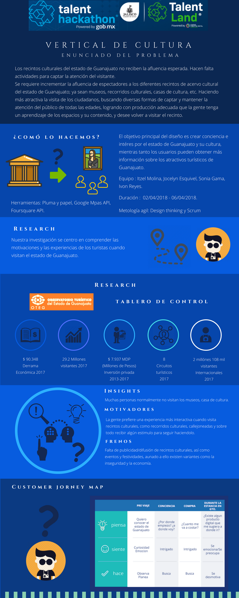
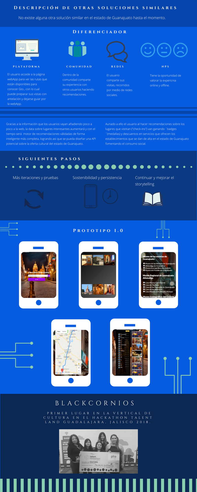

### Descubre Guanajuato

 Desarrollamos una webApp para Guanajuto, donde consuminos las API´S de Google Places, Firebase y Foursquare, para ofrecerle al usuario una solución integral que le permita descubrir el estado de forma lúdica además de propiciar la participación ciudadana, genera comunidad, ya que el usuario puede recomendar lugares, leer opiniones, ver y recorrer las rutas favoritas y compartir imágenes de su visita. Ayuda a mantener informado al usuario sobre los recintos culturales y puntos de interés, con lo cual podremos generar una data del estado y construir nuestra propia API. Con esto podremos generar experiencias 100% personalizas para nuestras audiencias,lo que nos ayudará a aumentar la derrama económica del turismo en 10% e incrementar la economía local.

Para la realización de este proyecto se hizo uso de las metodologías ágiles Inception y Scrum para desarrollar el producto en un tiempo estimado de 3 días.

## Herramientas
- Trello
- Canva
- Figma
- Google forms

# Desarrollo del Producto

